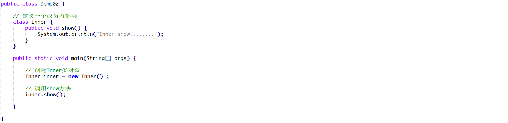
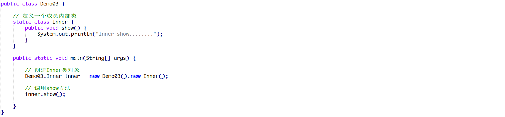
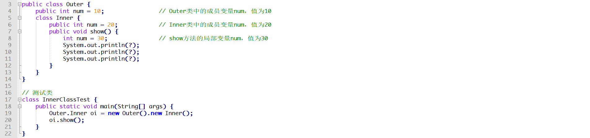

# 1 简答题

## 1.1 简答题一

请分析如下程序是否会报错并说明原因？并给出正确的代码！

|  |
| ------------------------------------------------------------ |

```java
 成员内部类 Inner 无法直接在静态方法 main 中创建实例
 把 Inner 类改为静态内部类
 public class Demo02 {
    // 静态内部类，不依赖外部类对象
    static class Inner { 
        public void show() {
            System.out.println("Inner show........");
        }
    }

    public static void main(String[] args) {
        // 直接创建静态内部类对象
        Inner inner = new Inner(); 
        inner.show();
    }
}
```

## 1.2 简答题二

请分析如下程序是否会报错并说明原因？并给出正确的代码！

|  |
| ------------------------------------------------------------ |

```java
Inner 类是静态内部类（static class Inner），但创建对象时错误地使用了非静态内部类的创建语法 。
Demo03.Inner inner = new Demo03.Inner();
```

## 1.3 简答题三

如下程序想在控制台输出30,20,10那么在9,10,11行代码的输出语句中应该填写什么代码？

|  |
| ------------------------------------------------------------ |

```java
  // 输出局部变量 num = 30
System.out.println(num); 
// 输出内部类成员变量 num = 20
System.out.println(this.num); 
// 输出外部类成员变量 num = 10
System.out.println(Outer.this.num); 
```

## 1.4 简答题四

下面lambda表达式的书写是否正确并说明原因？并给出正确的代码！

|  |
| ------------------------------------------------------------ |

```java
参数类型不一致
show((a, b) -> a + b);
```


## 1.5 请问有几种形式的内部类？

成员内部类 静态内部类 局部内部类 匿名内部类

## 1.6 请问内部类会被编译成class文件吗？

会的，外部类名$数字.class

## 1.7 请问下面横线处分别填写什么代码，才能实现打印出注释的结果

```java
class Outside{
		private int a = 100;
		class Inside{
			private int a = 200;
			public void show(){
				int a = 300;
				System.out.println(Outside.this.a); // 100（外部类的成员变量）
            System.out.println(this.a);        // 200（内部类的成员变量）
            System.out.println(a);             // 300（局部变量）
			}
		}
	}
```


## 1.8 请按要求填写代码：

```java
	interface Animal{
		public  void show();
	}
	class Cat implements Animal{
		public  void show(){
			System.out.println("猫");
		}
		
	}
	class Test{
		public static void main(String[] args){
			fun(_new Cat()___);//请用子类的形式调用
			fun(_new Animal() { // 用匿名内部类的形式调用
            public void show() {
                System.out.println("猫");
            }
        }___);//请用匿名内部类的形式调用
		}
		public static void fun(Animal a ){
			a.show();
		}
	}	
```

# 2 代码题

## 3.1 Lambda练习

给定一个导演 Director接口，内含唯一的抽象方法makeMovie，且无参数、无返回值，请使用lambda表达式在Test中补全代码完成调用,打印输出“导演拍电影啦！”字样

```java
public interface Director {
	void makeMovie();
}
public class Test{
	public static void main(String[] args) {
		//请使用Lambda和省略格式调用invokeDirect方法,打印输出“导演拍电影啦！”字样
		
 	}

	private static void invokeDirect(Director director) {
  		director.makeMovie();
 	}
}
```

## 3.2 Lambda练习

给定一个计算器Calculator接口，内含抽象方法calc (减法)，其功能是可以将两个数字进行相减，并返回差值;

请分别使用Lambda的标准格式及省略格式调用 invokeCalc 方法，完成130和120的相减计算并输出计算结果;

```java
public interface Calculator {
	int calc(int a, int b);
}
public class Test10InvokeCalc {
	public static void main(String[] args) {
        //请分别使用Lambda【标准格式】及【省略格式】调用invokeCalc方法来计算130-120的结果
       
        //省略格式
        
    }

	private static void invokeCalc(int a, int b, Calculator calculator) {
		int result = calculator.calc(a, b);
  		System.out.println("结果是：" + result);
 	}
}
```


 