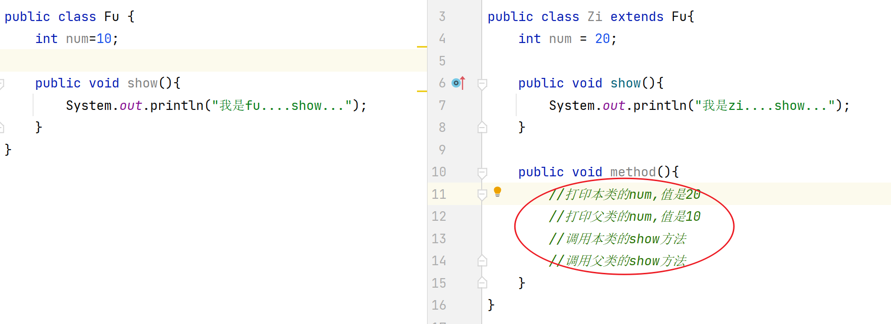

## 1. 简答题

### 简答题一

观察如图所示代码，完成注释位置的需求，填写对应的代码



```java
System.out.println("子类num: " + this.num); // 输出 20
System.out.println("父类num: " + super.num); // 输出 10
// 3. 调用子类的show方法
this.show(); // 输出 "我是zi....show..."
// 4. 调用父类的show方法
super.show(); // 输出 "我是fu....show..."

```


### 简答题二

请说出方法重写和方法重载的区别

```java
方法重写：在子父类中，子类有和父类一模一样的方法声明叫做方法重写。
方法重载：在同一个类中方法名相同，参数列表不同的方法构造方法重载
```


### 简答题三

说出final修饰类、修饰方法、修饰变量的特点

```java
被 final 修饰的类不能被其他类继承
被 final 修饰的方法不能被子类重写
被 final 修饰的变量只能赋值一次
```


### 简答题四

静态成员应该如何访问？

```java
通过类名直接访问 类名.成员名
```


### 简答题五

说出静态方法和实例方法的区别

```java
调用方式：静态方法调用类名.方法名() 实例方法对象名.方法名()
修饰符：静态方法有static修饰 实例方法没有
归属：静态方法是归属于类的 实例方法是对象的
```


## 2. 编程题

### 练习题一

**需求：**定义javabean，然后在测试类中测试。

1. 定义手机Phone类，有如下属性

```java
属性:
	品牌brand,价格price
行为:
	call方法,输出"打电话"
	sendMessage方法，输出"发短信",
	playGame方法,输出"玩游戏"
```

2. 假设所有的手机都有屏幕的尺寸(int size)，而且所有手机的屏幕尺寸为6，应该如何定义?  
3. 测试类，创建Phone类对象,打印属性值并调用Phone类中的方法。

**考查知识点：**JavaBean的定义、常量。

**提示：**无

**代码：**

```java
public static void main(String[] args) {

        // 创建 Phone 对象
        Phone phone = new Phone("华为", 3999.99);

        // 打印属性值
        System.out.println("品牌: " + phone.getBrand());
        System.out.println("价格: " + phone.getPrice());
        System.out.println("屏幕尺寸: " + Phone.SIZE); // 直接通过类名访问静态常量

        // 调用方法
        phone.call();
        phone.sendMessage();
        phone.playGame();
    }
}
public class Phone {
    private String brand;
    private double price;
    public static final int SIZE = 6;
    public void call(){
        System.out.println("打电话");
    }
    public void sendMessage(){
        System.out.println("发短信");
    }
    public void playGame(){
        System.out.println("打游戏");
    }

    public Phone() {
    }


    public String getBrand() {
        return brand;
    }

    public void setBrand(String brand) {
        this.brand = brand;
    }

    public double getPrice() {
        return price;
    }

    public void setPrice(double price) {
        this.price = price;
    }

    public Phone(String brand, double price) {
        this.brand = brand;
        this.price = price;
    }

    @Override
    public String toString() {
        return "Phone{" +
                "brand='" + brand + '\'' +
                ", price=" + price +
                '}';
    }
}

```


### 练习题二

**需求：**按照如下要求编程。

- 1. 定义项目经理类

  ```java
  属性：
  	姓名 工号 工资 奖金
  行为：
  	工作work
  ```

- 2. 定义程序员类

  ```java
  属性：
  	姓名 工号 工资
  行为：
  	工作work
  ```

- 3. 向上抽取一个父类(员工类)，共有成员放父类，特有成员放子类

- 4. 编写测试类，创建经理和程序员对象，调用工作的方法，运行结果如下：

  ```
  工号为100，姓名叫李飞的程序员月薪15000元，他正写代码。
  工号为26，姓名叫张伟的项目经理月薪30000元，奖金5000元，他正在汇报项目进度。
  ```

**考查知识点：**继承，方法重写。

**提示：**

1. 属性都需要封装

**代码：**

```java
public class Employee {
    private String name;
    private String id;
    private double salary;

    public Employee() {
    }

    public Employee(String name, String id, double salary) {
        this.name = name;
        this.id = id;
        this.salary = salary;
    }

    public String getId() {
        return id;
    }


    public String getName() {
        return name;
    }

    public double getSalary() {
        return salary;
    }

    // 工作方法（父类定义通用行为）
    public void work() {
        System.out.println("员工正在工作");
    }
}
public class Programmer extends Employee{

    public Programmer(String name, String id, double salary) {
        super(name, id, salary); // 调用父类构造方法
    }
    @Override
    public void work() {
        System.out.printf("工号为%s，姓名叫%s的程序员月薪%.0f元，他正写代码。\n",
                getId(), getName(), getSalary());
    }
}public class EmployeeTest {
    public static void main(String[] args) {
        Programmer programmer = new Programmer("李飞", "100", 5000);
        programmer.work();
        // 创建项目经理对象
        Manager manager = new Manager("张伟", "26", 30000, 5000);
        manager.work();
    }
}
public class Manager extends Employee{

    private double bonus;

    public double getBonus() {
        return bonus;
    }

    public void setBonus(double bonus) {
        this.bonus = bonus;
    }

    public Manager(String name, String id, double salary, double bonus) {
        super(name, id, salary); // 调用父类构造方法
        this.bonus = bonus;
    }

    // 重写 work 方法
    @Override
    public void work() {
        System.out.printf("工号为%s，姓名叫%s的项目经理月薪%.0f元，奖金%.0f元，他正在汇报项目进度。\n",
                getId(), getName(), getSalary(), bonus);
    }

}

```


### 练习题三

**需求：**按照要求，实现不同的动物发出不同的叫声

1. 定义动物类(Animal)作为父类，有姓名name属性，使用使用 Lombok给属性生成get/set等方法
2. 在父类中定义叫的方法yell()，输出"未知叫声"。
3. 定义子类 `Cat` 和 `Dog` 重写 `yell()`，分别输出"喵喵喵"和"汪汪汪"
4. 定义测试类，在测试类中定义数组保存多个动物对象，然后让这些动物都叫。输出结果如下：

```
喵星人：喵喵喵
旺财：汪汪汪
```

**考查知识点：**

1. 继承和方法重写
2. 对象多态

**提示：**

1. 保存Dog和Cat对象的数组应该定义成什么类型？
2. "然后让这些动物都叫"本质就是调用动物的yell()方法

**代码：**

```java
 public static void main(String[] args) {
        // 创建动物数组（多态：父类类型引用子类对象）
        Animal[] animals = {
                new Cat("喵星人") ,
                new Dog("旺财")
        };

        for (int i = 0; i < animals.length; i++) {
           animals[i].yell();
        }
    }
public class Cat extends  Animal{


    public Cat(String name) {
        this.setName(name);
    }

    @Override
    public void yell() {
        System.out.println(this.getName() + "：喵喵喵");
    }
}public class Dog extends  Animal{

    public Dog(String name) {
        this.setName(name);
    }

    @Override
    public void yell() {
        System.out.println(this.getName() + "：汪汪汪");
    }
}@Data
@AllArgsConstructor
@NoArgsConstructor
public class Animal {
    private String name;

    public void yell() {
        System.out.println("未知叫声");
    }
}
```
